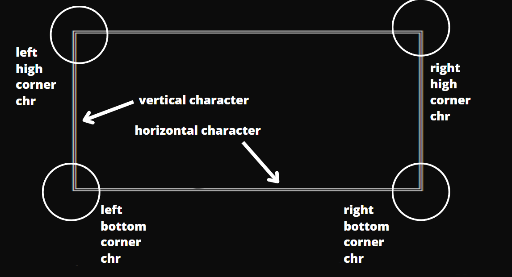
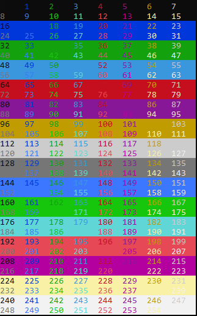
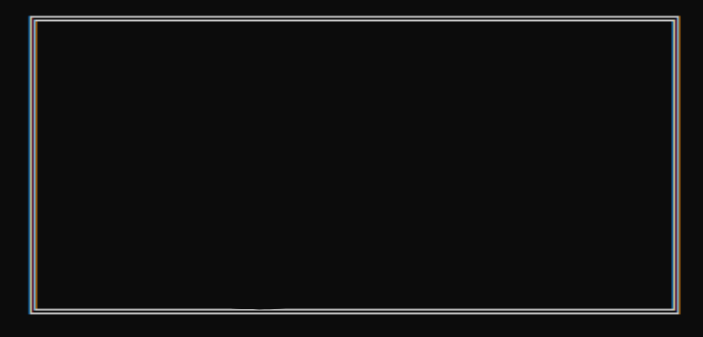
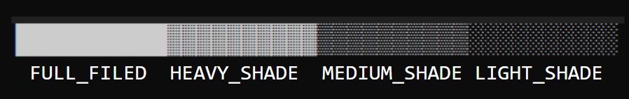
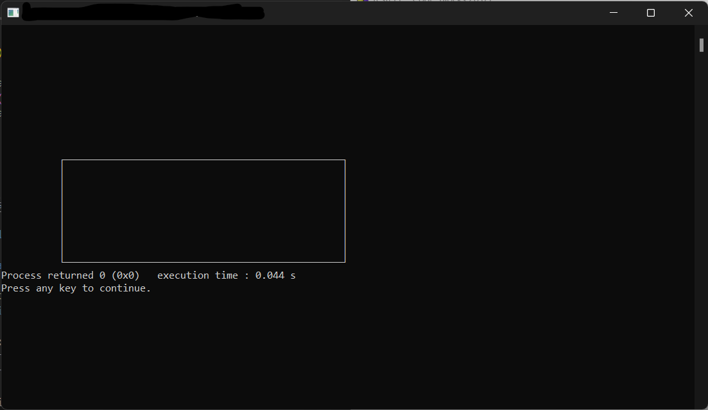
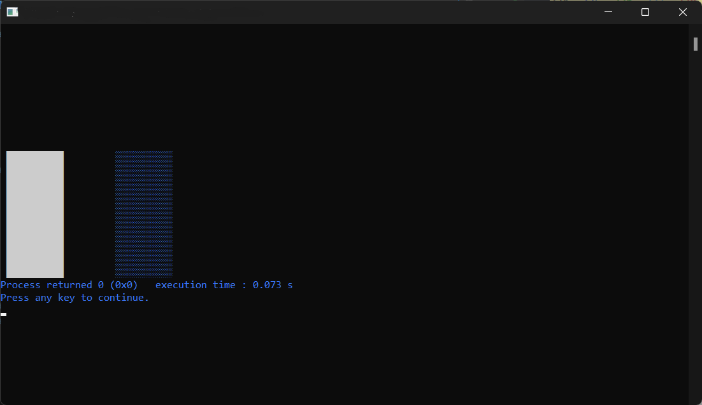
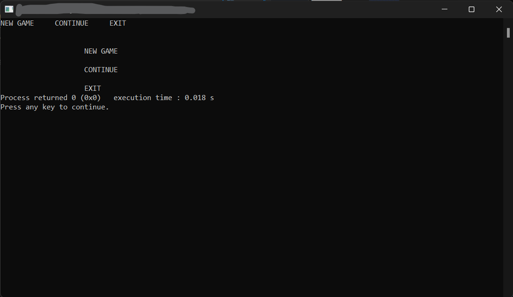

# cmd_utilities

#### Compatibility with Windows only.
#### Set of usefull functions to write on cmd.

### Included Headers

- stdio.h
- stdbool.h
- stdint.h
- windows.h
- wincon.h

### Types
- #### border_shape: 
###### set of characters to construct boxes



### Predefs

###### First 16 colors of color scheme below.
- #### colors: 
    - BLACK
    - DARK_BLUE,
    - DARK_GREEN,
    - DARK_BLUE_GREEN,
    - DARK_RED,
    - DARK_PURPLE,
    - DARK_BROWN,
    - DARK_GRAY,
    - LIGHT_GRAY,
    - LIGHT_BLUE,
    - LIGHT_GREEN,
    - LIGHT_BLUE_GREEN,
    - LIGHT_RED,
    - LIGHT_PURPLE,
    - LIGHT_YELLOW,
    - WHITE


#### CMD Color Scheme


#### All other colors can be obtained by combinations of the first 16 colors.

- #### Shapes
    - #### DOUBLE_LINE

    

    - #### SINGLE_LINE

    

- #### Characters

    - #### HEAVY_SHADE
    - #### MEDIUM_SHADE
    - #### LIGHT_SHADE
    - #### FULL_FILLED

    

### Functions
- #### set_to_fullsceen

    ###### Display the console in fullscreen mode.
    ```C
    bool set_to_fullscreen();
    ```
    ###### Returns 1 if all be done, and 0 if error.

- #### set_color

    ###### Change the text color and/or background color.
    ```C
    void set_color(uint16_t foreground_color, uint16_t background_color);
    ```

- #### move_cursor

    ###### Move the console cursor for the specified position in coluns and lines.
    ```C
    void move_cursor(uint16_t column, uint16_t line);
    ```

- #### write_text

    ###### Write a text in defined position.
    ```C
    void write_text(char *text, uint16_t column, uint16_t line);
    ```

- #### draw_box

    ###### Draw a empty static box with ASCII characters.
    ```C
    void draw_box(border_shape shape, uint16_t width, uint16_t height, uint16_t column, uint16_t line);
    ```
        width, height are defined in columns and lines
        column and line parameters specifie the box position

    ###### Example:

    ```C
    #include "cmd_utilities.h"

    int main(){

        draw_box(SINGLE_LINE, 50, 10, 10,10);

    return 0;
    }
    ```

    

- #### fill_rectangle

    ###### Draw a filled rectangle in specified position.
    ```C
    void draw_box(border_shape shape, uint16_t width, uint16_t height, uint16_t column, uint16_t line);
    ```

    ###### Example:

    ```C
    #include "cmd_utilities.h"

    int main(){

        fill_rectangle(FULL_FILLED, 10, 10, 1,10);
        set_color(LIGHT_BLUE, BLACK);
        fill_rectangle(LIGHT_SHADE, 10, 10, 20,10);

    return 0;
    }
    ```

    

- #### print_list

    ###### Draw a filled rectangle in specified position.
    ```C
    void print_list(char **string_array, uint16_t string_counter, uint16_t column, uint16_t line, uint16_t space, bool direction);
    ```
        space: the spacement between strings.
        if direction == 0 the spacement is in columns.
        if direction == 1 the spacement is in lines.

        diretion: print direction.
        0: horizontal
        1: vertical

    ###### Example:

    ```C
    #include "cmd_utilities.h"

    int main(){

        char* game_menu[] = {"NEW GAME", "CONTINUE", "EXIT"};

        print_list(game_menu, 3, 0, 0, 5, 0);
        print_list(game_menu, 3, 20, 3, 2, 1);

    return 0;
    }
    ```
    
